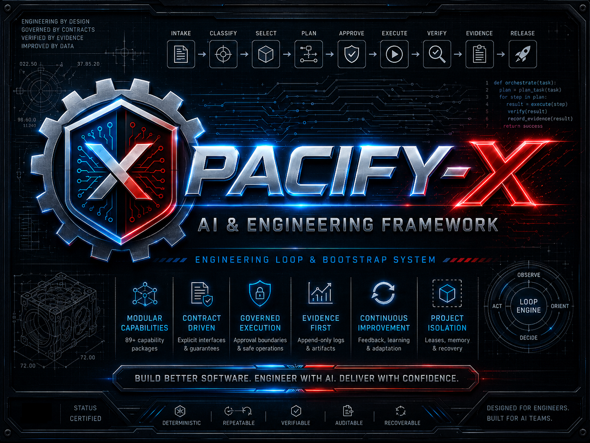

# PACIFY-X



## Engineering Loop & Bootstrap Framework

### **P**roject and **A**I **C**apabilities **I**ntelligence **F**ramework for **Y**ou

> **Make AI build software like an engineering team—not an overconfident intern.**

**Engineering Loop & Bootstrap is a capability engineering framework that transforms general-purpose AI models into governed, evidence-driven engineering systems through modular skills, orchestrations, contracts, and deterministic execution.**

**Current release:** v0.6.2 — revoked  
**Status:** Repair in progress; no deployment-authoritative release  
**Runtime:** Python 3.11+ with no required third-party runtime dependencies

> [!WARNING]
> Release 0.6.2 was revoked on 2026-08-03 after a full repair audit found that its self-certification did not bind the exact public artifacts, Git identity, publisher signature, and every evidence file into one independently authenticatable chain. Preserve it as historical evidence; do not deploy or cite it as release-authoritative. See [`evidence/release-revocation-0.6.2.json`](evidence/release-revocation-0.6.2.json).

PACIFY-X surrounds an AI coding assistant with the parts models usually lack: bounded planning, project isolation, explicit approvals, deterministic execution, independent validation, evidence, recovery, and repeatable engineering workflows. It loads compact metadata first and hydrates only the capability needed for the current step.

Human operator? Follow the five-minute start below. AI assistant? Read [`START_HERE_FOR_AI.md`](START_HERE_FOR_AI.md) before doing anything else.

## Start in five minutes

1. Clone or copy this repository to a stable `<BOOTSTRAP_DIR>`.
2. Choose a separate `<WORKSPACE_DIR>` for managed projects.
3. Install and validate the control plane:

```powershell
cd <BOOTSTRAP_DIR>
python -m pip install .
engineering-bootstrap doctor
engineering-bootstrap validate
```

4. Choose the matching ready-to-paste prompt:

   - [Create a new project](bootstrap/prompts/NEW_PROJECT_PROMPT.md)
   - [Adopt an existing project](bootstrap/prompts/EXISTING_PROJECT_PROMPT.md)

5. Replace its placeholders and paste the complete prompt into the AI assistant working from `<BOOTSTRAP_DIR>`.

The prompt validates the framework, previews every mutation, requests required approvals, establishes an isolated workspace and durable project-management state, and proves startup hydrated zero skill bodies.

For an existing repository, place it directly at:

```text
<WORKSPACE_DIR>/projects/<PROJECT_NAME>
```

Do not place PACIFY-X itself inside the managed `projects/` directory.

## Why it exists

AI coding assistants can forget architecture, overload their context, invent assumptions, modify unrelated code, skip denial paths, and call work complete without proving the outcome. PACIFY-X treats the model as an engineer operating inside an engineering organization—not as an unrestricted code generator.

It provides:

- metadata-only startup and lazy capability discovery;
- bounded skill selection and one-skill-at-a-time hydration;
- explicit plans, punch cards, dependencies, waves, and acceptance criteria;
- governed workflows with declared effects and approval boundaries;
- deterministic scheduling, budgets, retries, checkpoints, and stop conditions;
- isolated multi-project workspaces, leases, and project-scoped memory;
- append-only evidence, correction, recovery, and quarantine procedures;
- contract, registry, graph, integration, tool, package, sanitation, and release validation;
- ready-made entry prompts and IDE/assistant integration files.

It does **not** install a model, choose a provider, ship model weights, expose credentials, silently install tools, or modify a project without the applicable approval.

## How it works

```text
intake -> classify -> select -> plan -> approve -> execute -> verify -> evidence -> release
```

For each task, the framework:

1. classifies the request from compact metadata;
2. selects at most three candidate capabilities;
3. hydrates one chosen skill and only its direct references;
4. declares effects, budgets, evidence, and stop conditions;
5. previews governed mutations and obtains approval;
6. executes one bounded step;
7. verifies postconditions independently;
8. checkpoints evidence and releases task-specific context.

## Validated repository scale

These are current repository denominators, not approximate marketing totals. The categories intentionally distinguish selectable skills from broader capability and implementation surfaces.

| Layer | Exact count | What is counted |
|---|---:|---|
| Core runtime capabilities | 6 | Active capabilities in `registry/capability_map.json` |
| Project-stream engineering capabilities | 71 | Governed domain capabilities |
| Metacognitive capabilities | 50 | Declared metacognitive operations |
| Scheduling capabilities | 30 | Bounded scheduling operations |
| Skill packages | 89 | 60 selectable plus 29 inert/deferred packages |
| Executable workflow definitions | 24 | 7 general plus 17 project-stream YAML workflows |
| Runtime modules | 101 | Python modules under `runtime/` |
| Contracts | 82 | JSON contracts under `contracts/` |
| Registry artifacts | 205 | Registry files and generated governance projections |
| Validator functions | 50 | Runtime validation, audit, certification, verification, and check functions |
| Tool and support scripts | 112 | 29 framework scripts plus 83 skill-local scripts |
| Admitted exact tools | 56 | Individually certified authoritative tool implementations |

Startup does not load those surfaces into model context. It reads catalog metadata, selects a bounded working set, and hydrates one admitted skill at a time.

## Manual workspace setup

Run these commands from the PACIFY-X repository root. Every state-changing command is preview-first. Inspect the first result, then repeat with `--apply`:

```powershell
engineering-bootstrap workspace init --workspace ./workspace
engineering-bootstrap workspace init --workspace ./workspace --apply
```

The resulting layout is:

```text
Pacify-X/
`-- workspace/
    |-- engineering-workspace.toml
    |-- projects/                 # new projects and existing-repository drops
    |-- projects_tracking/        # registry, leases, receipts, checkpoints, memory
    |-- repo_quarantine/          # recoverable removals; never hard deletion
    `-- shared_capabilities/      # explicitly approved reusable releases
```

Create a new project:

```powershell
engineering-bootstrap workspace create-project --workspace ./workspace --name example-app
engineering-bootstrap workspace create-project --workspace ./workspace --name example-app --apply
engineering-bootstrap workspace status --workspace ./workspace
```

Adopt an existing project after placing it under `./workspace/projects/example-app`:

```powershell
engineering-bootstrap intake --project ./workspace/projects/example-app
engineering-bootstrap workspace discover --workspace ./workspace
engineering-bootstrap workspace discover --workspace ./workspace --apply
engineering-bootstrap workspace status --workspace ./workspace
```

Discovery preserves existing owner files byte-for-byte.

## First-run tooling assessment

Startup includes a read-only, bounded project assessment and returns observations separately from recommendations:

```powershell
engineering-bootstrap startup --project ./workspace/projects/example-app
engineering-bootstrap tooling assess --project ./workspace/projects/example-app
```

PACIFY-X never installs or configures a tool during discovery. A relevant missing optional tool produces a proposal with its effect and an explicit approval requirement. Obsidian can be proposed for documentation-heavy repositories. Graphify remains an optional reference-only integration; when absent, the framework routes graph work to its built-in `validate-knowledge-relationships` and `research-to-capability` skills.

## Lazy capability use

```powershell
engineering-bootstrap classify --task "validate an authorization workflow"
engineering-bootstrap working-set --goal "diagnose a Python authorization failure"
engineering-bootstrap hydrate --skill diagnose-python-repair
```

`working-set` returns no more than three candidates. `hydrate` loads one admitted skill body and its bounded direct references for that command only. Builders create inert candidates; they cannot promote themselves.

## Multiple projects and memory

One session may hold one writable project lease at a time. Separate sessions can work on separate projects.

```powershell
engineering-bootstrap project activate --workspace ./workspace --project-id prj_example-app --agent-id agent_a --session-id session_a
engineering-bootstrap project current --workspace ./workspace --session-id session_a
engineering-bootstrap project release --workspace ./workspace --session-id session_a --context-reset-confirmed
```

A same-session project switch requires `--context-reset-confirmed`. Project memory is isolated, append-only, provenance-bearing, and access-controlled. Retrieval exposes only certified or trusted records; corrections become new evidence-backed records.

## Safety guarantees

- Fail closed on ambiguous paths, registry drift, expired leases, missing approval, and foreign-project context.
- Never hard-delete owned, unknown, generated, failed, or superseded material; inventory, hash, quarantine, and verify it.
- Keep private memory, prompts, logs, embeddings, and source out of shared indexes.
- Preserve existing repository ownership and differing owner files.
- Treat model output and executor success claims as untrusted until postconditions and current evidence agree.
- Keep arbitrary long-running or untrusted tools behind an isolated process or service boundary.

## Validation and certification

Run the complete source checks after control-plane changes:

```powershell
$env:PYTHONDONTWRITEBYTECODE = "1"
python -m runtime.cli --root . audit licensing
python -m runtime.cli --root . audit structure
python -m runtime.cli --root . test-profile run fast
python -m runtime.cli --root . test-profile run full
# Release finalization is blocked while REL-011 closes the full repair audit.
python -m runtime.cli --root . release verify --release 0.6.2
```

The 0.6.2 verifier now fails closed because the project state and explicit revocation record deny deployment authority. A repaired release must build once, test and publish those exact artifacts, bind Git and evidence identity, and carry a trusted publisher signature before this section can advertise a release-authoritative certificate again.

## Major accomplishments

- Completed full repository disposition with no unresolved artifacts.
- Recovered and integrated previously missing engineering capabilities.
- Expanded metacognitive and scheduling orchestration layers.
- Added deterministic, bounded scheduling with approval, privacy, dependency, resource, retry, budget, and acceptance controls.
- Validated ownership and integration of all framework contracts.
- Converted capability discovery to lazy loading while maintaining zero eager skill hydration.
- Rejected unsafe implementations in favor of bounded, deterministic alternatives.
- Completed sanitation with no prohibited identifiers, placeholders, embedded ZIPs, or validation errors.

## Repository guide

| Path | Purpose |
|---|---|
| [`START_HERE_FOR_AI.md`](START_HERE_FOR_AI.md) | Required AI operator entrypoint |
| [`bootstrap/prompts/`](bootstrap/prompts/) | Ready-to-paste new/existing project prompts |
| [`bootstrap/startup.toml`](bootstrap/startup.toml) | Bounded startup configuration |
| [`.agents/skills/`](.agents/skills/) | Lazily hydrated skill packages |
| [`orchestration/`](orchestration/) | Executable workflow definitions and controls |
| [`contracts/`](contracts/) | Machine-checkable behavioral and data contracts |
| [`policies/`](policies/) | Approval, privacy, safety, and lifecycle policies |
| [`registry/`](registry/) | Capability, ownership, integration, and graph indexes |
| [`runtime/`](runtime/) | Installable control plane and CLI |
| [`evidence/`](evidence/) | Validation, migration, and release evidence |
| [`PROJECT_MANAGEMENT.md`](PROJECT_MANAGEMENT.md) | Framework lifecycle and punch-card state |

## What PACIFY-X is not

PACIFY-X does not replace engineering judgment or your preferred AI model. It provides the engineering environment around a model—not the model itself.

## Who it is for

- AI-assisted software engineers;
- teams managing multiple repositories;
- organizations building internal AI tooling;
- developers who want governed, repeatable AI workflows;
- anyone tired of repeating giant prompts every session.

## Additional Comments

This submission intentionally focuses on a complete, deterministic engineering framework suitable for general AI-assisted software development.

Several experimental and next-generation concepts were intentionally left out of the public release because they significantly increase complexity and are not required for the framework's primary goals.

Examples include research-oriented capabilities such as self-modeling deployment strategies, advanced blue/green execution architectures with autonomous model lifecycle management, and other experimental orchestration concepts.

These omissions are intentional scope decisions rather than unfinished work. My goal was to release a framework that is coherent, practical, and broadly applicable rather than including every experimental idea under active exploration.

If the framework is considered useful, I see it as a foundation that can continue evolving with additional research capabilities over time.

## License

Copyright © 2026  
Ben J. Cikovic,  
doing business as Mountain-Nomad-BC.

Licensed under the Apache License, Version 2.0.

See the [`LICENSE`](LICENSE) file for details and [`NOTICE`](NOTICE) for attribution.
