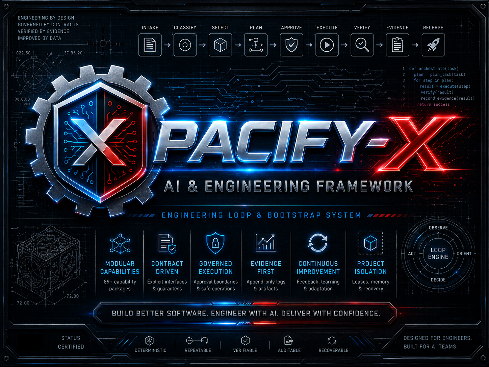

# PACIFY-X



## Engineering & Agent OS with Learning and Governance

### **P**roject and **A**I **C**apabilities **I**ntelligence **F**ramework for **Y**ou - e**X**perimental

> Make AI build software like an engineering team, not an overconfident intern.

Engineering Loop Utilization & Harnessing turns a general-purpose AI assistant into a governed, evidence-driven engineering system. It gives the AI the skills, rules, project memory, safety checks, and repeatable workflows it needs to manage software work responsibly.

PACIFY-X is the project and framework. `engineering-bootstrap` is its Python package and command-line control plane.

**Release status:** See [GitHub Releases](https://github.com/Mountain-Nomad-BC/Pacify-X/releases)
for signed artifacts and their verification evidence.

**Current line:** **v0.9.0** (see [`docs/release-process.md`](docs/release-process.md) for the
canonical release contract and exact artifact verification steps).

**Requires:** Python 3.11–3.14, Git, OpenSSH Client (`ssh-keygen`), and an AI coding assistant.
Local model lanes additionally require a CUDA-capable GPU, CMake + an MSVC toolset + the
**Windows SDK**, and the CUDA toolkit (see the install prompt below).

---

> **For AI and human reviewers:** the complete source repository, commit history, contracts,
> tests, and certification evidence live at
> [github.com/Mountain-Nomad-BC/Pacify-X](https://github.com/Mountain-Nomad-BC/Pacify-X).
> You can investigate, check, and verify everything here **before** installing anything.
> The repository is the authority; a built artifact is only as trustworthy as the source it
> came from.

## What PACIFY-X does for you

You describe the project and the outcome you want. PACIFY-X helps the AI:

- understand a new or existing codebase before changing it;
- keep different projects and their memories separate;
- choose only the skills needed for the current task;
- make a plan, track the work, and ask before risky actions;
- test its work and collect evidence before claiming success;
- recover or quarantine material instead of silently deleting it;
- use Engineering Genomics to help turn knowledge into operational code;
- log and monitor usage, identifying candidates for learning, processes, workflows, orchestrations, and skill creation or refinement;
- evaluate multiple potential candidates, test and refine them, and combine validated results into canonical knowledge;
- maintain multilayer persistent memory.

### Local AI, under governance

PACIFY-X runs no model of its own until you choose one. When you do, the local stack is
governed rather than ad-hoc:

- **Resident librarian** — a small, fast, CPU-first model that handles retrieval, knowledge
  navigation, skill and action selection, and Pacify-X's own index/graph/memory upkeep.
- **On-demand usage worker** — a larger MoE-class model loaded only when a task genuinely needs
  it, held under an exclusive resource lease, never autoloaded.
- **System-1 decision layer** — a non-autoregressive decision engine that answers bounded
  typed questions (`choice` / `score` / probability) in one forward pass, so the expensive
  models are only invoked when real reasoning is required. It recommends; Pacify-X decides.
- **PX Agent Console** — a right-side VS Code chat surface that owns task state and routes
  every provider call through Pacify-X's provider gateway. It holds no provider authority of
  its own.

The model is replaceable. Pacify-X owns structure, identity, authority, evidence, retrieval
generations, memory boundaries, lifecycle, and validation.

You do not need to learn the internal orchestration system or memorize a large command set.
That is the AI’s job. The human-facing setup is intentionally short.

## Start here

### 1. Let the installer read your machine

```powershell
git clone https://github.com/Mountain-Nomad-BC/Pacify-X.git
cd Pacify-X
python -m pip install .
python scripts/px_install.py
```

`px_install.py` inspects the machine (OS, Python, Git, VS Code, GPU, VRAM, RAM, disk, whether
an approved local runtime is already built, and which models are present) and prints an
**ordered commissioning plan** with a recommended profile. It performs **no** effect on its
own: it never downloads a model, installs a runtime, or enables a provider. Run it with
`--apply` to record the plan under `.engineering-bootstrap/commissioning/`.

| Profile | What you get | Needs | Extra disk |
|---|---|---|---|
| minimal | Deterministic PX only | — | ~2 GB |
| librarian-only | Resident CPU-first librarian | 24 GB RAM | ~8 GB |
| workstation | Librarian + on-demand deep worker | GPU ≥ 6 GB VRAM, 24 GB RAM | ~30 GB |
| hybrid-escalation | The above + policy-gated remote slot | provider credentials | ~30 GB |

### 2. Let the AI perform the setup

Open the prompt that matches how you are starting — [new project](bootstrap/prompts/NEW_PROJECT_PROMPT.md)
or [existing project](bootstrap/prompts/EXISTING_PROJECT_PROMPT.md) — and paste the whole thing
into your AI assistant. If you want local models, also hand it
[`bootstrap/prompts/LOCAL_AI_INSTALL_PROMPT.md`](bootstrap/prompts/LOCAL_AI_INSTALL_PROMPT.md),
which walks the assistant through the runtime build, model admission, placement calibration,
extension packaging, and one proven operational turn — asking your approval at each gated step.

### 3. Verify at any point

```powershell
python -m runtime.cli validate            # engine + generated-state validity
python scripts/px_install.py --json       # machine-readable environment + plan
python scripts/audit_local_paths.py       # repo-wide portability check (0 findings expected)
```

`ssh-keygen` is required for effect-grant and release-signature verification. On Windows install
the built-in **OpenSSH Client** optional capability if that command is unavailable; on
Linux/macOS install the operating system's OpenSSH client package. PACIFY-X reports the missing
executable instead of silently weakening signature checks.

## Where your projects go

PACIFY-X stays separate from the projects it manages:

```text
<PACIFY_X_DIR>/

<WORKSPACE_DIR>/
|-- projects/
|   `-- <PROJECT_NAME>/
|-- projects_tracking/
|-- repo_quarantine/
`-- shared_capabilities/
```

For an existing repository, place it at:

```text
<WORKSPACE_DIR>/projects/<PROJECT_NAME>
```

Do not place PACIFY-X itself inside the managed `projects` folder.

## What happens during a task

In plain language, the AI follows this loop:

```text
understand → plan → ask when needed → work → test → prove → remember
```

PACIFY-X loads only a small capability catalog at startup. It opens one relevant skill at a time instead of flooding the AI’s context with every skill, policy, and contract in the framework.

## Working with more than one project

Each project gets its own identity, workspace, memory, evidence, and write boundary. One AI session can write to only one active project at a time. Switching projects requires an explicit context reset, which helps prevent code or memory from bleeding between repositories.

## Safety in plain language

- Risky or destructive actions require an explicit boundary and, when applicable, your approval.
- Unknown, failed, or superseded material is inventoried and quarantined rather than hard-deleted.
- AI output is treated as a proposal until tests and postconditions support it.
- Private project memory is not placed into another project’s memory or shared index.
- Tools and integrations are discovered first; PACIFY-X does not silently install or configure them.

PACIFY-X does not include an AI model, model weights, a provider account, or credentials. It is the engineering system around the model you choose.

## If you are the AI assistant

Read [START_HERE_FOR_AI.md](START_HERE_FOR_AI.md) before taking any project action. It contains the skeptical-engineering startup contract, lazy-loading rules, project isolation requirements, and verification sequence.

If the user wants a local model stack, also read
[`bootstrap/prompts/LOCAL_AI_INSTALL_PROMPT.md`](bootstrap/prompts/LOCAL_AI_INSTALL_PROMPT.md).
It gives the exact phases, the model decisions to ask the user about, the approval gates, and
the evidence expected at each step. Do not download a model, build a runtime, or enable a
provider without the user's explicit approval for that step.

## More detail when you want it

- [AI setup and operating contract](START_HERE_FOR_AI.md)
- [Local AI install prompt for the AI assistant](bootstrap/prompts/LOCAL_AI_INSTALL_PROMPT.md)
- [Architecture, governance, and risk](ARCHITECTURE_GOVERNANCE_AND_RISK.md)
- [Release and verification process](docs/release-process.md)
- [Benchmark operational assurance](docs/benchmark-operational-assurance.md)
- [Security policy](SECURITY.md)
- [Trust boundary and CLI decisions](docs/trust-boundary.md)
- [Project management and punch-card state](PROJECT_MANAGEMENT.md)
- [Evidence authority and limitations](evidence/README.md)
- [VS Code extension](../extension/README.md)

<details>
<summary>Maintainer verification counts</summary>

These exact counts are checked automatically for drift; ordinary users do not need them.

| Layer | Exact count |
|---|---:|
| Runtime modules | 367 |
| Contracts | 180 |
| Registry artifacts | 515 |
| Tool and support scripts | 206 |

The machine-readable source for release and inventory claims is [`registry/build_claims.json`](registry/build_claims.json).

PX-owned map history and committed transaction journals use explicit, dry-run-first
archive gates. Older evidence is reclaimed only after a deterministic archive,
member-level SHA-256 verification, and a recovery receipt are complete; see
[`policies/operational-evidence-retention.json`](policies/operational-evidence-retention.json).

</details>

The default branch is the current development line. Contributors working from `main` should use the setup in [CONTRIBUTING.md](CONTRIBUTING.md).

PACIFY-X does not include an AI model, model weights, a provider account, or credentials. It
is the engineering system around the model you choose — and it will tell you exactly what it
needs before it asks for anything.

## License

Copyright © 2026  
Ben J. Cikovic,  
doing business as Mountain-Nomad-BC.

Licensed under the Apache License, Version 2.0.

See [LICENSE](LICENSE) for the license text and [NOTICE](NOTICE) for attribution.
